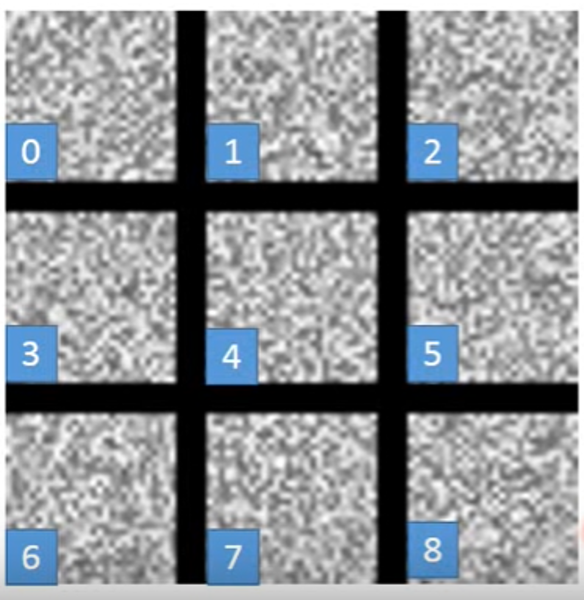
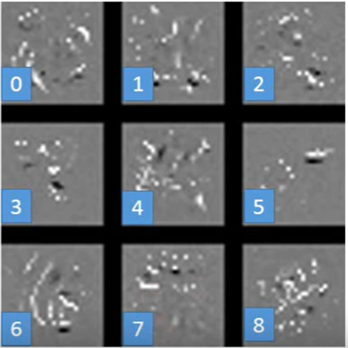
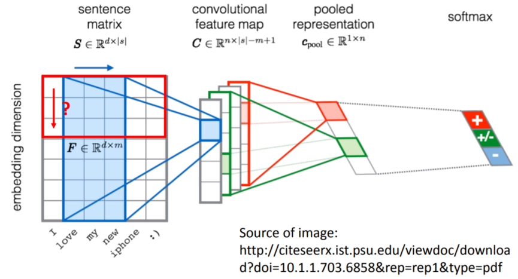

# Convoution Neural Network

-   **CNN: simplify neural network structure**
    -   用prior knowledge把原来fully connected 的layer里面的一些参数拿掉就变成CNN

## WHY CNN FOR IMAGE
-   PROTERY1: A neuron does not have to see the whole image to discover the pattern.
    -   Connecting to small region with less params.
    -   USE CONVOLUTION
-   PROTERY2: We don't need to use more than one neuron to detect the same pattern in different region, because the neurons do almost the same thing, they can share the same set of params. 
    -   For example, we don't need to use two neuron to detect the beak in the upper-left and in the middle of the image .
    -   USE CONVOLUTION
-   PROTERY3: We can subsample the pixels to make image smaller, because that will not change the object.
    -   Less params for the network to process the image
    -   USE MAX POOLING

## WHOLE STRUCTURE OF CNN
-   STEP1: IMPUT IMAGE
-   STEP2: CONVOLUTION
-   STEP3: MAX POOLING
-   **STEP2 & STEP3 CAN REPEAT MANY TIMES**
-   STEP4: FLATTEN
-   STEP5: FULLY CONNECTED FEEDFORWARD NETWORK
-   OUTPUT

### CONVOLUTION
- Filter
    -   filter其实就是一个matrix，但里面的参数是通过学习得到的。filter决定整个image里面有没有某个pattern出现。filter通常比image小，也就是说filter实现了property1，只看局部就可以找到pattern
    -   HOW FILTER OPERATE？
        -   以一张$6\times 6$的黑白image为例，里面被划分为36个格子。假设你的filter是个$3\times 3$的matrix，把filter放到image左上角，做内积，然后再往右移继续做内积。这边挪动的距离叫做stride，那么这个stride等于多少就自己设置就好了。就这样重复移到右下角继续做内积后，我们就得到一个新的matrix。
        -   我们的filter也侦测出来这个pattern在哪个位置，这个就顺便实现了property2。也就是说，我们不需要考虑pattern在多个位置从而要做好几个位置相关的pattern，我们只要做一个filter就够了。
        -   好多个filter和image的内积结果的matrix就叫做feature map。这些新的matrix也是image，展现pattern的image。在这个过程中，你有多少filter，你的feature map就有多少image。
        -   如果是彩色的image，他还有RGB的参数，那实际上一张image是由三个matrix叠加而成的立方体，那你的filter也是三层的matrix的立方体。用RGB表示一个pixel的话，那你的input就是$3\times 6\times 6$，filter就是$3\times 3\times 3$。但是，我们在做convolution的时候，我们不是每个channel分开来算，而是合在一起算，九对数字做内积。就每个filter他都考虑到了不同颜色所代表的channel。
-   Convolution VS. Fully Connected
    -   convolution就是fully connected把一些weight拿掉，not fully connect

### MAX POOLING --> subsampling
- How max pooling?
    -   我们在上一阶段（接着黑白image的例子），通过两个filter得到了两个$4\times 4$的matrix。那接下来要做的是把这两个output都划分为4个一组的$2\times2$ matrix。那么接下来就是要做选择了，你可以保留这四个数中最大的那一个也可以选平均，就自己定啦，总之就把原来四个value合成一个value。
    -   这件事的作用就是**让你的image缩小**
	- Conclution 
		○ 做完一套convolution+max pooling后，我们$6\times 6$ 的 image就变成了$x\times 2\times 2$的image, x是这个新image cubic的深度，也就是你的filter数，也相当于你这一个pixel用几个value来表示。我们得到new image but smaller and each filter is a channel。
		○ **注意**，我们的filter在做计算时，不是每个channel分开来，而是合并在一起看。假设我们第一阶段的conv+mp做完后，我们经过25个filter得到一个有25层的new image，下一阶段我们还有25个filter。但新的image不会再增加一个维度。新阶段的filter他其实是一个深度为25的cubic，把一个pixel的所有value都同时考虑进去了。所以新阶段你的output是25个。你通过多少个filter，你的output就多少层。

### FLATTEN & FULLY CONNECTED FEEDFORWARD NETWORK
-   就是把你得到的feature map拉直，然后丢到fully connected feedforward network

## CNN in Keras < to be edicted >
-   Only modified the network structure and input format (vector -> 3-D tensor)

## WHAT DOES CNN LEARN?
### WHAT FILTER DO?
-   Assume that the output of the k-th filter is a 11*11 matrix. And we call each element $a_{ij}^{k}$, where k is the k-th filter, i is row and j is column.
-   Then we define a **degree of the activation of the k-th filter**, which means how match between input and k-th activate. 
$a^{k}=\sum^{11}_{i=1}\sum^{11}_{j=1} a_{ij}^{k}$
-   And now we want to know how the k-th filter work, so we need to find an input image which make the max degree of k-th filter activated, that is maximized the a^{k}.
-   Assume the input image is x. Then we have $x^{*} = arg\space max_{x}\space a^{k}$ (that's a optimization problem). We can use **gradient ascent** to solve this problem. (IF now we are going to calculate minimization, we use gradient descent.)
-   The result is we will see what filter detect.
### WHAT FULLY CONNECTED FEEDFORWARD NETWORK DO?
- CONSIDER NEURON
    -   Find an image maximizing the output of neuron. We define the output of j-th neuron is $a_{j}$.
    -   And we use gradient descent to find a image x which meet $x^{*} = arg\space max_{x}\space a^{j} $
    -   The neuron detect the whole image, not just a region. The image which makes the neuron max activate is a complete image not a texture.
-   CONSIDER OUTPUT
    -   Each output correspond to a digit. Assume we pick a one dimension of output call $y^{i}$. Then we find a image x let the output maximize. $x^{*} = arg\space max_{x}\space y^{i}$
    -   The result is strange. It doesn't look like a digit. But if we put these image into the machine , it will still tell us the correct answer.
    
    -   So, whether we have a way to let the image looks like a real digit people write. We can do some constraint to $x$. Change the formua to $x^{*} = arg\space max_{x}\space (y^{i}-\sum_{I,j}|x_{i,j}|)$. 
        -   We over all pixel values(L1 regularization)
        -   So the formula mean, we should let the summantion of $x_{i,j}$ smaller the better while maximize the $y^{i}$. That is we hope the image we find with less ink (white area).
        -   And after adding the constraint, we get:
          
          It looks better.

## SOME METHODS
### DEEP DREAM
-   If you give machine an image, it will add what it see in the picture. 
-   HOW TO DO?
    -   把image扔进CNN里，然后把某一个hidden layer拿出来。把这个vector的负值变更小，正值变更大。
    -   把调整好的vector当作新的image的目标。也就是把modify image当作新的input。**Let CNN exaggerates what it sees.**
### DEEP STYLE
-   Give an image, make its style like other picture, maybe some famous painting.
-   Reference: https://arxiv.org/abs/1508.06576
-   HOW TO DO?
    -   首先我们把待处理的image A扔到CNN里，得到CNN的filter的output。这个output代表这张image里面有什么样的content。
    -   然后我们再拿一张要变成的风格的图image B也扔到CNN里， 同样得到filter的output。但是这时候，我们不关注这个output里的value具体是什么样的，而是把重点放在filter和filter直接output的correlation，这表示整张图的style。
    -   接下来，还是用同样的CNN找一张image，它拥有imageA的content的同时，也拥有imageB的style。这里就是用gradient descent，找一张image同时满足content和style这两个cretia的maximize。

## MORE APPLICATION
### PLAYING GO
-   Fully-connected feedforward network can be used. But CNN performs much beter.
-   对CNN来说，就是把棋盘当作一个19*19的image，再让他output下一步要落子的位置
-   根据围棋的特性，alphaGO没有用Max Pooling (可以看看AlphaGO的paper中的neural network architecture)
### Speech
-   The filters move in the frequency direction
### Text
-   Reference: http://citeseerx.ist.psu.edu/viewdoc/download?doi=10.1.1.703.6858&rep=rep1&type=pdf
-   每个word是一个vector， 所有vector横向排列在一起就是一句话的image。
-   filter的高和每个word的vector一样长，也就是embedding dimension
-   filter的移动方向只在时间方向上移动
-   在embedding上所有dimension上是independent的，所以filter在embedding方向上移动是不会make sense的

**但是，不是所有的机器学习相关都可以用CNN， 首先它要能有适合CNN的特性。就比如棋盘，我们是可以把他当作image来看的，所以我们可以用CNN， 但它又不满足property3， 所有我们在设计CNN的时候，我们没有使用max pooling**

>### Reference
> - Hung-yi Lee, *Machine Learning*,  Convolutional Neural Network
> - https://arxiv.org/abs/1508.06576
> - http://citeseerx.ist.psu.edu/viewdoc/download?doi=10.1.1.703.6858&rep=rep1&type=pdf
> - https://discovery.ucl.ac.uk/id/eprint/10045895/1/agz_unformatted_nature.pdf
